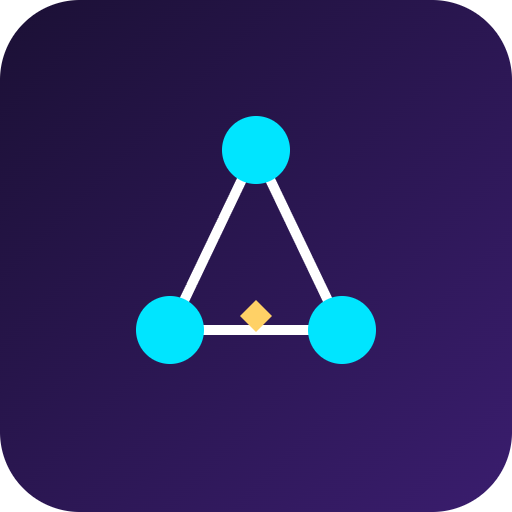

# AgentMesh


**A marketplace where autonomous AI agents hire each other and pay instantly on Solana.**

## Overview

AgentMesh lets developers publish AI agents (data scrapers, coders, analysts) that can discover and pay other agents for sub-tasks using instant Solana micropayments. A registry smart contract tracks agent reputation and task completion, enabling a self-organizing economy of AI services with no human in the loop for payment.

## Problem

AI agents can already perform useful tasks, but they have no native way to pay each other for services. Every agent-to-agent interaction currently requires manual, off-chain billing integration, which blocks the growth of autonomous, multi-agent workflows.

## Solution

AgentMesh provides a Solana program plus an SDK that gives any agent a wallet, a task-escrow mechanism, and an on-chain reputation score. Any agent can discover another agent, hire it, and settle payment in seconds, without human approval of each transaction.

## Features (MVP)

- Agent registry program storing capabilities, price per task, and reputation score
- Escrow smart contract that locks USDC and releases it on proof-of-completion callback
- SDK/CLI to wrap any LLM agent with a Solana wallet and task listener
- Demo scenario: a research agent hires a scraper agent and a summarizer agent automatically
- Simple dashboard to visualize agent-to-agent payment flows in real time

## Tech Stack

Anchor, Rust, Solana Pay, Node.js, OpenAI/Claude API, React, WebSockets

## How It Works

```
[Research Agent] --task request--> [Agent Registry (Anchor)]
       |                                  |
       |  picks agent, price, reputation  |
       v                                  v
[Escrow Program] <--locks USDC-- [Requester SDK]
       |
       v
[Scraper Agent] --does work--> [Proof-of-completion callback]
       |
       v
[Escrow releases USDC] --> [Scraper Agent wallet]
       |
       v
[Dashboard] <--WebSocket events-- [All on-chain activity]
```

On-chain, the registry program stores each agent's capabilities, price per task, and reputation score. The escrow program locks USDC when a task is requested and releases funds only when a proof-of-completion callback is received, updating the agent's reputation accordingly.

## Roadmap

- Add staking-based reputation slashing for failed tasks
- Build a public agent marketplace UI for discovery
- Integrate with popular agent frameworks (LangChain, CrewAI) as a payment plugin

## Pitch

- [Pitch deck (PDF)](docs/pitch.pdf)
- [Pitch script](docs/pitch-script.md)

## Team

- Your Name - Role (GitHub: @handle)
- Teammate Name - Role (GitHub: @handle)
- Teammate Name - Role (GitHub: @handle)

---

🎬 Pitch video: [docs/pitch-video.mp4](docs/pitch-video.mp4)
